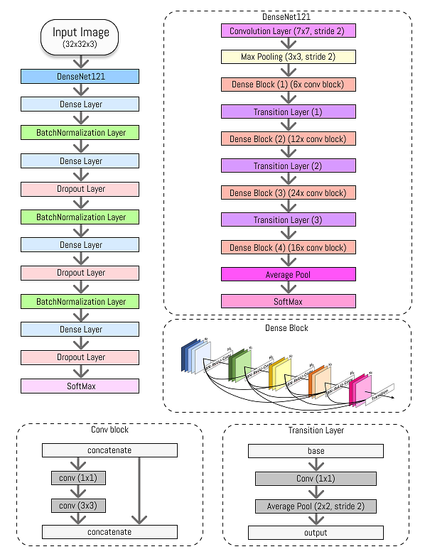

# Histopathological-Cancer-Detection 
 ### Autores 
Fernando dos Reis Santos Filho RA: 234471

Larissa Souto Zagati RA: 178060

Leandro Stival RA: 263013

Matheus Neves J O Santos RA: 241827

 ### Introdução 

Este trabalho pretende treinar um modelo para identificar câncer metastático
em pequenos fragmentos de imagem de varreduras histopatológicas de seções de
linfonodos. Estes linfonodos (gânglios linfáticos) são pequenas estruturas que
funcionam como filtros para substâncias nocivas, fazendo parte do sistema
imunológico. Assim, no combate ao câncer, é necessário o
desenvolvimento de **técnicas de classificação** de células metastáticas nos linfonodos
como indício da presença de tumores em outras regiões do organismo.

### Dados
A base de dados é composta por 220.025 imagens RGB com a resolução
32x32 pixels e também está disponível em um arquivo no formato .csv contendo o
rótulo de cada imagem, ou seja, se a mesma representa um câncer metastático ou
não. Esse dataset está disponível no [kaggle](https://www.kaggle.com/qitvision/a-complete-ml-pipeline-fast-ai) desde 2019 e conta com mais 1.000
equipes mesmo após o encerramento da competição. A vantagem da escolha dessa
base é que, como ela é um pouco mais antiga, possui diversos tópicos de
discussão, o que demonstra a relevância dessa categoria de análise. Outra
vantagem dessa base, é que a distribuição das amostras estão consideravelmente
balanceadas com uma distribuição de 60/40 entre imagens sem e com metástase e
que a variável alvo está bem definida, evitando eventuais problemas no treinamento.

### Redes Neurais
Para a classificação das imagens, foram utilizadas três arquiteturas de redes
neurais convolucionais (CNN), um tipo de rede especificamente arquitetada para
processar pixels, por facilitar o reconhecimento de objetos em imagens. Para isso
realizou-se em primeiro lugar a separação dos dados entre treino e validação, sendo
60% para treinamento e 40% para validação. O tamanho da base de dados é um
dos primeiros problemas para essa técnica. Como trata-se de uma quantidade
bastante expressiva de imagens, não é possível alocá-las em memória de uma
única vez. Portanto, foi necessário que o treinamento fosse realizado em lote. Cada
lote carrega 64 imagens para a memória somente no momento que forem utilizadas
para treinamento ou validação.

O framework [Keras](https://keras.io/getting_started/) foi utilizado para implementar as CNNs, que utilizam
da transferência de aprendizado, permitindo nos aprofundar no funcionamento das
redes, por exemplo, utilizando a rede DenseNet121 como a camada
convolucional do trabalho responsável pela extração de características das
imagens. Os pesos originais (treinados com a base de dados da ImageNet)
foram re-treinados com as imagens do dataset aqui descrito. Ainda sobre a rede
DenseNet121, assim como nas demais, os inputs de uma camada mais avançada
representam um tipo de “concatenação” dos outputs das camadas anteriores. Desse
modo, o surgimento desse tipo de rede foi a partir da necessidade de minimizar o
efeito dos “vanishing gradients” em redes com muitas camadas entre as de entrada
e saída. A DenseNet121 é uma versão da rede DenseNet que possui cinco
Convolutional e Pooling layers, três Transition layers (6, 12, 24), uma Classification
layer (16) e dois Denseblocks (1x1 e 3x3 conv). Desse modo, 5 + (6+12+24+16) * 2
= 121.

A parte responsável por realizar a classificação das características obtidas
pela DenseNet121 é composta por quatro camadas densas utilizando a função de
ativação ReLU, inicialização dos pesos utilizando a função He normal e um termo de
regularização L2 para controlar o overfitting da rede. Entre todas as camadas
densas, foi realizada o processo de batch Normalization para evitar problemas com
o gradiente. Entre as camadas 2 e 3, foi utilizada a técnica de Dropout com 20% de
chance de zerar os pesos entre os neurônios. Entre a camada 4 e a de decisão foi
utilizada a mesma técnica, porém, com a chance de 30%, sendo a camada de
decisão uma Softmax de duas classes (visto que o problema é binário). Podemos
observar uma ilustração das arquiteturas da rede e DenseNet121.

  
  
  O código dos modelos pode ser encontrado neste [notebook](notebook/Transfer%20Learning%20%2B%20Decision.ipynb) e os resultados neste [pdf](Resultados.pdf)
